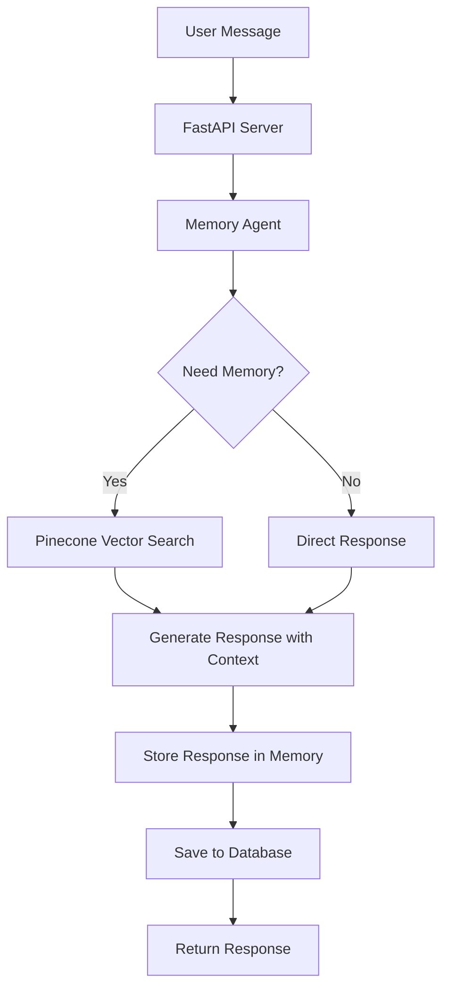

# 🧠 Memory-Enabled AI Chatbot

A production-ready chatbot with memory capabilities using OpenAI GPT-4 and Pinecone vector database.

## 📁 Project Structure

```
OpenAI_Agent/
├── backend/                 # Backend services
│   ├── api.py              # FastAPI REST API
│   └── my_agent2.py        # Memory-enabled agent
├── frontend/               # Frontend interface
│   └── streamlit_app.py    # Streamlit web app
├── config/                 # Configuration files
│   ├── requirements.txt    # Python dependencies
│   └── env_template.txt    # Environment variables template
├── tests/                  # Test suite
│   ├── test_api.py         # API tests
│   ├── run_tests.py        # Test runner
│   └── pytest.ini         # Test configuration
├── run_api.py             # API server launcher
├── run_streamlit.py       # Streamlit app launcher
└── README.md              # This file
```

## 🚀 Quick Start

### 1. Setup Environment

```bash
# Copy environment template
cp config/env_template.txt .env

# Edit .env with your API keys
OPENAI_API_KEY=your_openai_api_key_here
PINECONE_API_KEY=your_pinecone_api_key_here
MEMORY_INDEX_NAME=chatbot-memory
```

### 2. Install Dependencies

```bash
pip install -r config/requirements.txt
```

### 3. Run the Application

**Option A: Streamlit Web Interface**
```bash
python run_streamlit.py
```

**Option B: FastAPI Backend**
```bash
python run_api.py
```

## 🧪 Testing

```bash
cd tests
python run_tests.py
```

## 📖 Features

- **Memory-Enabled Conversations**: Remembers past interactions using Pinecone
- **REST API**: FastAPI backend with full documentation
- **Web Interface**: Beautiful Streamlit frontend
- **Session Management**: Multiple user sessions with isolated memories
- **Comprehensive Testing**: Unit and integration tests

## 📡 API Documentation

When running the API server, visit:
- **Interactive docs**: http://localhost:8000/docs
- **API info**: http://localhost:8000/info

## 🔧 Configuration

All configuration files are in the `config/` folder:
- `requirements.txt` - Python dependencies
- `env_template.txt` - Environment variables template

# Memory Chatbot - Production Ready Chatbot with Vector Memory

A minimal but production-shaped chatbot that runs end-to-end in the cloud with autonomous memory functionality using Pinecone vector database.

## 🚀 Core Features

- **Vector-based Memory**: Every user message is automatically stored in Pinecone vector database
- **Autonomous Memory Retrieval**: AI autonomously decides when to fetch relevant past conversations
- **Production Ready**: FastAPI server with proper error handling, logging, and database persistence
- **Conversation History**: SQLite database for structured conversation storage
- **Multiple Endpoints**: Simple chat and full conversation history management

## 🏗️ Architecture



## 📋 Core Scenario

The chatbot autonomously manages memory:

1. **Message Storage**: Every user message is vector-indexed in Pinecone
2. **Autonomous Decision**: On each new message, the AI must decide whether to call the retrieve_relevant_memories tool
3. **Memory Retrieval**: Agent calls the tool when relevant memories are available
4. **Context Integration**: Retrieved memories are naturally integrated into responses
5. **Continuous Learning**: All interactions are stored for future reference

## 🛠️ Setup Instructions

### 1. Environment Setup

Copy the environment template:
```bash
cp env_template.txt .env
```

Fill in your API keys in `.env`:
```env
OPENAI_API_KEY=your-openai-api-key-here
PINECONE_API_KEY=your-pinecone-api-key-here
MEMORY_INDEX_NAME=chatbot-memory
MODEL_CHOICE=gpt-4o-mini
```

### 2. Install Dependencies

```bash
pip install -r requirements.txt
```

Required packages:
- `fastapi`
- `uvicorn`
- `openai`
- `pinecone-client`
- `sqlalchemy`
- `python-dotenv`
- `agents` (your custom agent framework)

### 3. Run the Server

```bash
python api.py
```

The server will start on `http://localhost:8000` with:
- Automatic Pinecone index creation
- SQLite database initialization
- Production-ready logging

## 📚 API Documentation

### Chat Endpoints

#### POST `/chat`
Main chat endpoint with full memory functionality and database persistence.

**Request:**
```json
{
  "user_id": "user123",
  "message": "What's my favorite color?"
}
```

**Response:**
```json
{
  "user_id": "user123",
  "message": "What's my favorite color?",
  "response": "Based on our previous conversation, your favorite color is blue!",
  "conversation_history": [["User", "I love blue"], ["Assistant", "Great choice!"]],
  "memory_retrieved": true,
  "memory_count": 2
}
```

#### POST `/chat/simple`
Lightweight chat endpoint without database persistence (memory still works via Pinecone).

### Memory Testing Endpoints

#### GET `/memories/test/{user_id}?query=text`
Test what memories would be retrieved for a specific query.

**Example:** `GET /memories/test/user123?query=favorite color`

**Response:**
```json
{
  "user_id": "user123",
  "query": "favorite color",
  "would_retrieve_memories": true,
  "memory_count": 2,
  "memories": ["I love blue colors", "Blue is my favorite"]
}
```

#### GET `/memories/stats/{user_id}`
Get memory statistics for a user.

#### POST `/memories/store`
Manually store a memory for testing purposes.

**Request:**
```json
{
  "user_id": "user123",
  "message": "I love pizza",
  "message_type": "user"
}
```

### Conversation Management

#### GET `/chat/history/{user_id}`
Retrieve conversation history for a user.

#### DELETE `/chat/history/{user_id}`
Clear database conversation history (Pinecone memories preserved).

### System Endpoints

#### GET `/health`
Health check endpoint.

#### GET `/info`
Comprehensive API information with examples and memory trigger keywords.

## 🧠 Memory System

### How Memory Works

1. **Automatic Storage**: Every message gets vectorized and stored in Pinecone with metadata:
   ```json
   {
     "user_id": "user123",
     "message": "I love machine learning",
     "message_type": "user",
     "timestamp": "1648123456"
   }
   ```

2. **Autonomous Memory Decisions**: The system automatically decides when to retrieve memories using a decision function that checks for:
   - **Memory keywords**: "remember", "recall", "mentioned", "discussed", "my favorite", etc.
   - **Personal indicators**: "what do i", "my", "what's my", "tell me about me"
   - **Conversation context**: Length and relevance of current conversation

3. **Smart Retrieval**: When triggered, the system retrieves the top 3 most relevant past memories (similarity score > 0.7)

4. **Context Integration**: Retrieved memories are seamlessly integrated into the agent's context without explicit mention

### Memory Decision Logic

The autonomous decision function `should_retrieve_memories()` evaluates:

```python
# Triggers memory retrieval:
- "What's my favorite color?"         ✅ (contains "my favorite")
- "Remember what we discussed?"       ✅ (contains "remember")  
- "What do I like to eat?"           ✅ (contains "what do i")

# Does NOT trigger memory retrieval:
- "Hello, how are you?"              ❌ (simple greeting)
- "What's the weather today?"        ❌ (general question)
- "Tell me about AI"                 ❌ (new topic)
```

This ensures memory is used efficiently - only when it adds value to the conversation.

## 🏭 Production Deployment

### Environment Variables
```env
# Required
OPENAI_API_KEY=sk-...
PINECONE_API_KEY=...

# Optional
DATABASE_URL=postgresql://... # For production database
PORT=8000
MODEL_CHOICE=gpt-4o-mini
```

### Docker Deployment
```dockerfile
FROM python:3.11-slim

WORKDIR /app
COPY requirements.txt .
RUN pip install -r requirements.txt

COPY . .
CMD ["python", "api.py"]
```

### Cloud Deployment
- **Heroku**: `git push heroku main`
- **Railway**: Connect GitHub repo
- **DigitalOcean App Platform**: Deploy from GitHub

## 🔍 Monitoring & Logging

The application includes:
- Structured logging for all operations
- Health check endpoints
- Error handling with proper HTTP status codes
- Performance monitoring for vector operations

## 🧪 Testing the Memory

1. **Start a conversation:**
   ```bash
   curl -X POST "http://localhost:8000/chat" \
     -H "Content-Type: application/json" \
     -d '{"user_id": "test123", "message": "I love pizza with mushrooms"}'
   ```

2. **Continue later:**
   ```bash
   curl -X POST "http://localhost:8000/chat" \
     -H "Content-Type: application/json" \
     -d '{"user_id": "test123", "message": "What food do I like?"}'
   ```

The agent should remember your pizza preference!

## 🎯 Key Decisions

### Why This Architecture?

1. **Pinecone for Memory**: Semantic search over conversations, not just keyword matching
2. **Autonomous Decisions**: Agent decides when memory is helpful, not manual triggers
3. **Dual Storage**: Pinecone for semantic memory, SQLite for structured history
4. **Production Ready**: Proper error handling, logging, and scalability considerations

### Memory vs History

- **Memory (Pinecone)**: Semantic understanding of conversations, cross-session context
- **History (Database)**: Structured storage for audit trails and conversation replay

## 🚨 Error Handling

The system gracefully handles:
- Missing API keys (fails fast with clear error)
- Pinecone connection issues (falls back to basic responses)
- OpenAI API failures (retry logic and fallbacks)
- Database connection problems (memory still works)

## 🔒 Security Considerations

- API keys stored in environment variables
- User data isolated by user_id
- No sensitive data logged
- Database parameterized queries (SQL injection protection)

## 🎉 Success Criteria

✅ **Memory Functionality**: Every message stored and retrievable  
✅ **Autonomous Decisions**: Agent decides when to use memory  
✅ **Production Ready**: Proper error handling, logging, deployment  
✅ **End-to-End**: Complete working system from API to vector storage  
✅ **Cloud Ready**: Can be deployed immediately to any cloud platform  

This is a minimal but complete implementation of a memory-enabled chatbot ready for production use! 